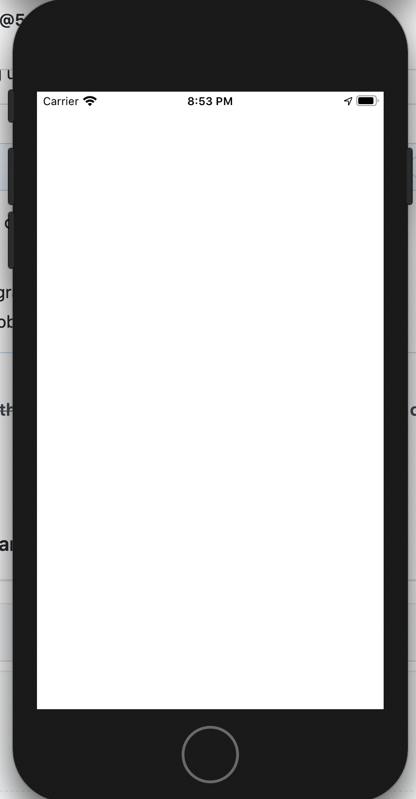

# Regression on upgrade from cordova-ios@5.1.1 to cordova-ios@6.1.0

This is an MVCE showing that ionic1 apps run using
`cordova-plugin-ionic-webview` stop working on upgrade from cordova-ios@5.1.1
to `cordova-ios@6.1.0`

This repository contains two directories. The directories contain a minimal ionic1 sample project, copied from https://github.com/ccoenraets/directory-angular-ionic, courtesy @ccoenraets

The only difference between them is the `cordova-ios` version.

```
$ diff -r -uw working_copy broken_copy
diff -r -uw working_copy/package.json broken_copy/package.json
--- working_copy/package.json	2020-07-15 20:56:06.000000000 -0700
+++ broken_copy/package.json	2020-07-15 20:54:30.000000000 -0700
@@ -30,7 +30,7 @@
     }
   },
   "dependencies": {
-    "cordova-ios": "^5.1.1",
+    "cordova-ios": "^6.1.0",
     "cordova-plugin-ionic": "5.4.7",
     "cordova-plugin-ionic-webview": "5.0.0"
   }
```

## Initial setup

This sets up node, npm and cocoapods correctly. It uses nvm for the node
install so it won't affect any existing setup. Alternatively, you can install
the dependencies from `setup/export_shared_dep_versions.sh` manually.

```
$ bash setup/setup_ios_native.sh
```

## Working setup

Note that this sets up the node dependencies locally in the `node_modules` in the `working_copy` directory.

```
$ cd working_copy
$ npm install
$ npx cordova prepare
$ npx cordova emulate ios
```

## Broken setup

Note that this sets up the node dependencies locally in the `node_modules` in the `broken_copy` directory.

```
$ cd broken_copy
$ npm install
$ npx cordova prepare
$ npx cordova emulate ios
```

## Result

| Working copy | Broken copy |
| -----------  | ----------- |
|  | 
 
